# jinja
## Introduction
Jinja is a popular template engine based on Python, widely used in web development, especially in conjunction with web frameworks such as Flask and Django. It allows developers to use specific syntax structures in templates to dynamically generate HTML, XML, or other text format outputs. Jinja provides a flexible syntax and functionality that enables developers to easily integrate dynamic data into static templates, thereby creating dynamic web pages.

## Prepare the jinja

First, download the pip installation package for Windows from the Python website.
 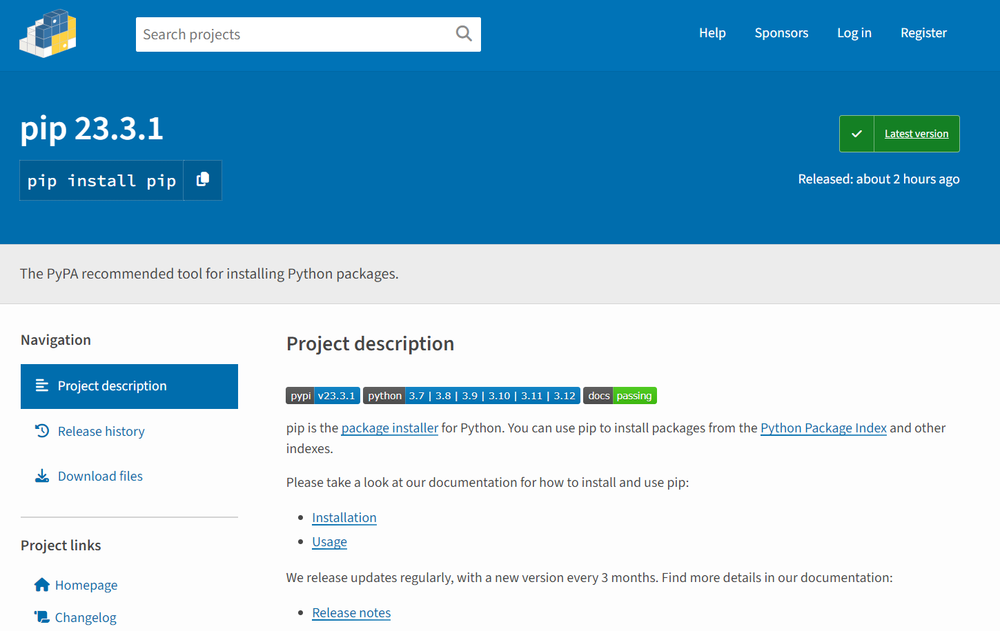

After the download is complete, you will get a compressed package and unzip the compressed package.
 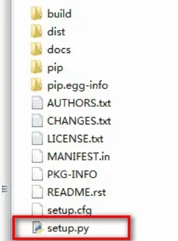

Open the system termina and use the cd command to access the uncompressed folder to the executable directory.

Type the following command on the console and press Enter, and the console will automatically install pip.
> python setup.py install

Enter the following command and press the Enter key to install.

> pip install Janja

 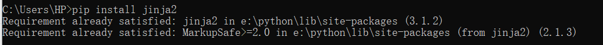

## Basic API usage

The most basic way to do this is to create a template from a Template and render it. If your template is not loaded from a string, but from a file system or other data source, this is not the recommended way anyway:

   ```python
    from jinja2 import Template
    template = Template('Hello {{ name }}!')
    result = template.render(name='John Doe')
    print(result)
   ```
By creating an instance of the Template, you get a new template object that provides a method called render() that calls augmenting the template when there is a dictionary or keyword argument. The dictionary or keyword argument is passed to the template, the template "context".

## Basic structure
1. Set up routing and view functions (app.py)
First, we need to set up routing and view functions in the app.py file. In Flask, we can use the @app.route decorator to specify the URL path, and then define a corresponding view function to handle requests for this path. These view functions usually return a rendered template, as well as the data that needs to be passed to the template.

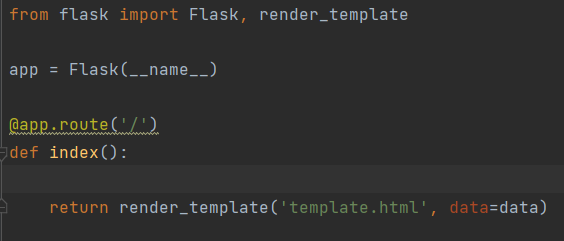

2. Design template file structure
In Flask, template files are used to render dynamic content, including HTML, CSS, JavaScript, etc. In the template file, we can insert variables through double curly braces {{ variable name }} to display dynamic content on the page. You can also use control structures, such as conditional statements and loop statements, to dynamically generate page content.

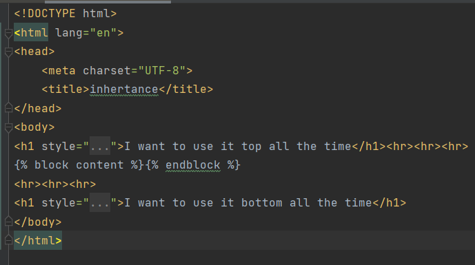

3. Static files
Flask allows us to create a folder called static in the root directory of the application to store static files such as images, CSS, and JavaScript files. These files do not need to be dynamically generated and therefore can be served directly from the server to the client.

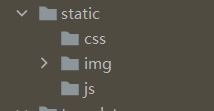


4. Import modules
 we need to import necessary modules, including `Flask`, `render_template`, `Template`

- `Flask`: It is a miniature Web framework written in python that is used for Web applications.

- `render_template`: It is used to render the template file with the data passed to it and generate the final HTML page.

- `Template`: It is used to process template files and generate rendered text.

```python

from jinja2 import Template

from flask import Flask, render_template

```
## Basic example

### ***variable***

#### **app .py**

a path should be given in "app.py": /test2_variable/<var_1>
`app.py`
```python
class Client:
    def __init__(self, id, name):
        self.ID = id
        self.Name = name

@app.route('/test2_variable/<var_1>')
def test2(var_1):  # put application's code here
    user = Client(1, "Dante")
    other_client = {
        "ID": 2,
        "name": "River"

    }
    return render_template("test2_variable.html", other_client_in_page = other_client, my_name="Dante", var_in_html = var_1, user_in_html = user)
```
- In this part, three variables are designed.
1. `var_1`: the variable is in the path and the data will be given by the clients. It will be transfer to the corresponding template.
2. `user`: this is a object from the class Client: ID is *1*, and name is *Dante*.
3. `other_client`: this is a directory with the ID of *2* and name of *river*
- `render_template` will help the programmer transfer the data in the variables to the template. And in template, those data will be saved in the corresponding variables in template. So, three new variables are designed.
1. `var_1`: var_in_html
2. `user`: user_in_html
3. `other_client`: other_client_page
4. new data can also be added directly in `render_tempate`, like "Dante" inside `my_name`.

#### **variable.html**

In folder template. a file named `test2_variable.html` are designed.

If the programmer want to use the variables of the template, `{{the name of variable}}` is the rule to use them. two braces should be in both sides. In this file, `var_in_html` is used in line 10.

`test2_variable.html`
```html {.line-numbers}
<!DOCTYPE html>
<html lang="en">
<head>
    <meta charset="UTF-8">
    <title>variable</title>

</head>
<body>

    <h1>var in html is {{ var_in_html }}</h1>
    <h2>My name is Dante</h2>
    <h3>{{ user_in_html.ID }}</h3>
    <h3 style="color: white; background: black">user_in_html is {{ other_client_in_page.name }}</h3>
    <hr>

    {#bracket#}
</body>
</html>
```
- `var_in_html` the data inside the variable will be changed accroding to the path client input, the path **http://127.0.0.1:5000/test2_variable/aaa** is used to test, the data inside `var_in_html` is "aaa". it is the result from browser:

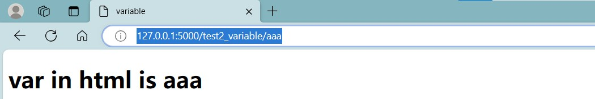

- `user_in_html` The data in the variable is an object with two parameters. We can use "variable.parameter_name" to show the parameters. It's similar to the common usage. Let it show the ID of the variable.

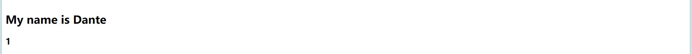

- `other_client_in_page` When we want to show the value in the directory, we can also use the same way: "variable.key_of_value". Let it show the name.

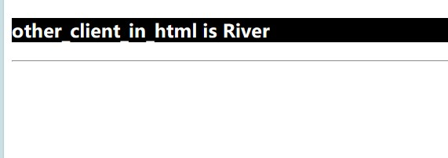


### ***filter***
Variables can be modified through "filters", which can be understood as built-in functions and string handling functions in jinja2.

#### **app .py**
```python
    @app.route('/')
    def index():
        # Sample data
        my_string = "hELLo WorLD"
        my_list = ['apple', 'banana', 'cherry']
        my_variable = None
        # Render templates and pass data and filters
        return render_template('template.html', my_string=my_string, my_list=my_list, my_variable=my_variable)
```
The render_template function in python code renders the template file template.html with the supplied data, and the variable name in template.html corresponds to the variable name passed in the first piece of code. Thus, when the Flask application runs, it populates the template in template.html based on the data passed in the render_template function, and finally generates an HTML page containing this data.

#### **template.html**
Need to use pipes after variables (|) Splitting, multiple filters can be called in chains, and the output of the previous filter is used as the input of the latter filter.

`template.html`
```html
    <!-- template.html -->
    <!DOCTYPE html>
    <html>
    <head>
        <title>Jinja2 Filter Example</title>
    </head>
    <body>
        <h2>Original String: {{ my_string }}</h2>
        <h2>Capitalized: {{ my_string|capitalize }}</h2>
        <h2>Lowercase: {{ my_string|lower }}</h2>
        <h2>Uppercase: {{ my_string|upper }}</h2>
        <h2>Default Value: {{ my_variable|default('No value provided') }}</h2>
        <h2>List Length: {{ my_list|length }}</h2>
        <h2>Joined List: {{ my_list|join(', ') }}</h2>
    </body>
    </html>
```

- In this part, five filters are designed.

1. `{{ my_string|capitalize }}`: This filter capitalizes the first letter of the my_string variable, converting the rest of the letters to lowercase.


2. `{{ my_string|lower }}`: This filter converts the my_string variable to lowercase.


3. `{{ my_string|upper }}`: This filter converts the my_string variable to uppercase.


4. `{{ my_list|length }}`: This filter calculates and displays the length of the list my_list.


5. `{{ my_list|join(', ') }}`: This filter joins the elements in the list my_list with commas and spaces to form a single string.


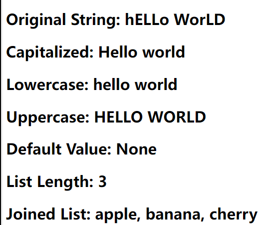
### ***static***

Static files are files that do not need to be generated dynamically in a web application, such as images, style sheets, and JavaScript files. In Flask, static files are usually stored in the static directory at the root of the application. Flask automatically exposes static files in that directory to the outside world so that they can be referenced in templates.
  

#### **app .py**
```python
    app = Flask(__name__)
    @app.route('/test6_static/')
    def test6():  # put application's code here
        return render_template("test6_static.html")
```
- `/test6_static/`:It is defined using the @app.route decorator, linking it to the function test6.
The test6 function calls the render_template function, which renders the template file named "test6_static.html" and returns the rendered content.
When a user accesses the URL **http://127.0.0.1:5000/test6_static//**, the Flask application will invoke the test6 function and return the rendered template content to the user's browser.


#### **static.html**
`test6_static.html`
```html
    <!DOCTYPE html>
    <html lang="en">
    <head>
        {#<link rel="stylesheet" href="{{ url_for('static', filename='css/') }}">#}
        {#<script src="{{ url_for('static', filename='js/') }}"></script>#}
        <meta charset="UTF-8">
        <title>image</title>
    </head>
    <body>
        
    </body>
    </html>
```
Make sure you have files named style.css and script.js in the static folder. This way, when you access the root path of the Flask application, an HTML page containing a reference to a static file is returned.

### ***control***

In Flask, you can use the Jinja2 template engine to control the rendering logic in your templates.   This means that you can use conditional statements and loops in your templates to dynamically generate HTML content.   These controls determine whether to include specific HTML content at render time based on the data provided, you can pass data to the template as it renders, and use control structures to dynamically generate page content based on that data.   This allows you to generate different pages for different situations, providing a better user experience.

#### **app .py**
```python
    @app.route('/test4_control')
    def test4():  # put application's code here
        mark = 80
        #mark = 30
        T1 = [{
            "ID": "Faker",
            "position": "Mid"
        },
            {
            "ID": "Zeus",
            "position": "top"
            },
            {
            "ID": "Oner",
            "position": "jug"
            },
            {
            "ID": "Gumayusi",
            "position": "AD"
            },
            {
                "ID": "Keria",
                "position": "sup"
            }]
        return render_template("test4_control.html", mark_in_html= mark, T1_in_html = T1)
```

- `T1`: Defines a list of multiple dictionaries.

 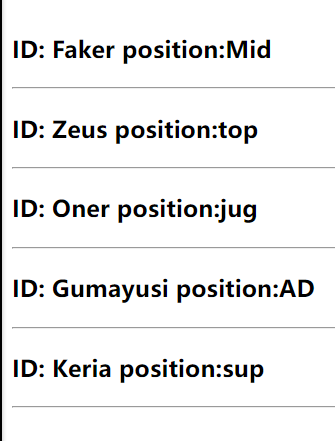

- `render_template`: The render_template function was called to render the template file named 'test4_control.html' and the values of the variables mark and T1 were passed.

Examples of conditional and loop statements:

#### **control.html**
```html
    <!DOCTYPE html>
    <html lang="en">
    <head>
        <meta charset="UTF-8">
        <title>control</title>
    </head>
    <body>

    # brace and percent symbol
    <h1>mark is {{ mark_in_html }}</h1>
    
        <h2>You have passed the exam</h2>
        
        <h2>Sorry, but don't panic</h2>
    
    <br>
    <br>
    <br>
    
        <h3>ID: {{ teammember.ID }} position:{{ teammember.position }}</h3><hr>
    
    </body>
    </html>
```
1. Conditional statements:
Jinja2's conditional statements are used to perform different actions in a template based on specific conditions. It allows us to execute different blocks of code depending on the truth or falsity of certain conditions.

- ``,``: It is a conditional statement. It checks if the variable mark_in_html is greater than or equal to 40. If the condition is true, it will show <h2>You have passed the exam</h2>, otherwise it will show <h2>Sorry, but don't panic</h2>.

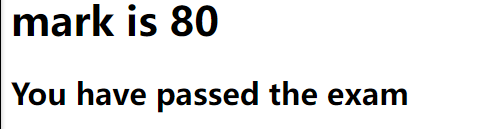


2. Loop statements
- ``,``: It is a loop statement that iterates through each element in the list T1_in_html. In each iteration, the variable teammember represents an element in the list, and we can access its properties through the teammember.

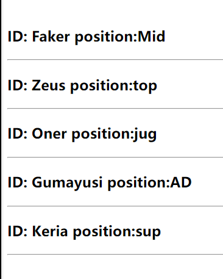
### ***inheritance***
The most powerful part of Jinja is template inheritance. Template inheritance allows you to build a basic template "skeleton" that contains elements common to your site and defines the blocks that child templates can override.
#### **app .py**
```python
@app.route('/test5_inheritance/')
def test5():  # put application's code here
    user2 = Client(3, "Faker")
    return render_template("test5_inheritance.html")
```
1. `test5_inheritance`: A view function named test5 is defined that handles GET requests for the /test5_inheritance/ path.
2. `user2`: A client object named user2 is created that has an attribute with ID 3 and the name "Faker".
3. `return`: It renders a template named test5_inheritance.html using render_template functions and returns it as an HTTP response.


# Flask-SQLAlchemy

## Introduction

Flask-SQLAlchemy is a powerful extension to Flask that simplifies the integration of SQL databases with applications, and it leverages the SQLAlchemy library (*SQLAlchemy is a powerful Python SQL package that allows users to perform a variety of database operations, including creating, reading, updating and deleting (CRUD) data*) to provide an easy way to interact with databases. With Flask-SQLAlchemy, users can define models as Python classes corresponding to database tables, which makes working with databases very intuitive. It supports a wide range of relational databases, provides ORM (Object-Relational Mapping) functionality, and helps with tasks such as database migration, query optimisation and session management.

SQLAlchemy supports a wide range of database backends, including SQLite, MySQL, PostgreSQL, Oracle, and more, so user can easilychoose the suitable database for their project.


Open the system terminal, enter the following command and press the Enter key to install

> pip install flask-sqlalchemy

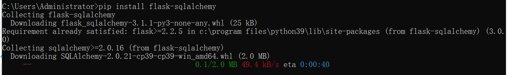


## Application--Simple login and registration page

Here we use a simple application to show how to perform various database operations (CRUD).

First we need to open pycharm and create a new project.

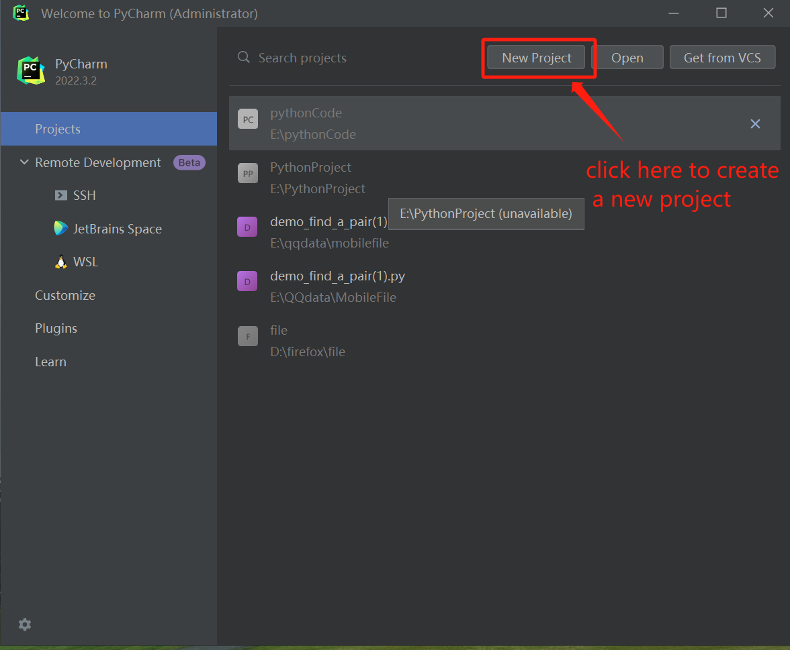


### **app .py**

1. Import modules and libraries

   we need to import necessary modules, including `Flask`, `render_template`, `redirect`,`request` , `session`and `SQLAlchemy` .

   - `Flask`: Import the Flask framework, it is used to create web applications.

   - `render_template`:used to render the HTML templates.

   - `redirect`: it is used to redirect the user's browser to a different page.

   - `session`: used to handle user sessions.

   - `SQLAlchemy`:used to handle database operations.

     ```python
     from flask import Flask, render_template, redirect, request, session

     from flask_sqlalchemy import SQLAlchemy
     ```

   ​

2. Create flask application and set up some configuration

   - Set the application's  SECRET_KEY, it is used for encrypting session data to insure security.
   - we use `SQLALCHEMY_DATABASE_URI` to specify the path to the SQLite database file.
   - create a SQLAlchemy  instance`db` and associate it with the flask application to handle database operations.

   ​

   ```python
   #Create a flask application
   app = Flask(__name__)
   app.config['SECRET_KEY'] = 'secretkey'  
   app.config['SQLALCHEMY_DATABASE_URI'] = 'sqlite:///users.db'  
   #Creating SQLAlchemy Objects
   db = SQLAlchemy(app)
   ```

   ​

3. Define user data mode

   We use `db.Model` to create a `User` data model for mapping to the User table in the database.

   ```python
   # User Data Model
   class User(db.Model):
       id = db.Column(db.Integer, primary_key=True)
       username = db.Column(db.String(50), unique=True, nullable=False)
       password = db.Column(db.String(100), nullable=False)
   # Define the __repr__ method
       def __repr__(self):
           return f'<User {self.username}>'
   # set up the application context
   with app.app_context():
       # Creat database tables
       db.create_all()
   ```


4. Define the route and perform database operations:

   - index route:

     It is the mian route of the application, user can accessed this page when navigate to the root URL("/"). It checks whether the user is logged in by verifying the existence of the 'username' in the session.If logged in, it retrieves all users from the database and displays a list of user IDs and usernames. It also provides two links: "Delete User" and "Update User Password."

     ```python
     # route：main
     @app.route('/')
     def index():

         if 'username' in session:
             # Retrieve all users from the database
             users = User.query.all()
             # Build a string with the "Successfully logged in" message
             message = 'Successfully logged in, username: ' + session['username'] + '<br>'+'<br>'

             # Add user information (id and username) to the message
             for user in users:
                 message += f'id: {user.id}, username: {user.username}<br>'
             # Add the "delete_user" link
             message += '<a href="/delete_user">Delete  user</a><br>'
             #Add the update password link
             message+= '<a href="/update_password">Update user password</a>'

             return message
         return 'not logged in'
     ```

     ​

   - login route

     Accessed  "/login," this route handles user login. It will check if a Post request(form submission) was made and tries to authenticate the user by querying the database with the provided username and password.If successful, the user is redirected to the main page, and their username is stored in the session.Otherwise, an error message is displayed.

     ```python
     # route:login
     @app.route('/login', methods=['GET', 'POST'])
     def login():
         if request.method == 'POST':
             username = request.form['username']
             password = request.form['password']
             user = User.query.filter_by(username=username, password=password).first()
             if user:
                 session['username'] = username
                 return redirect('/')
             else:
                 return 'login fail'
         return render_template('login.html')
     ```

   ​     

   - Logout Route

     accessed  "/logout," this route logs the user out.It simply removes the user's username from the session and redirects to the main page.

     ```python
     # route:logout
     @app.route('/logout')
     def logout():
         session.pop('username', None)
         return redirect('/')
     ```

     ​


   - Delete User Route

     This route allows users to delete other users.If a POST request is made , it will delete a user based on the provided username.It checks if the user exists, deletes the user's record from the database, and commits the change. Then a success or failure message is displayed.

     ```python
     #route:delete
     @app.route('/delete_user', methods=['GET', 'POST'])
     def delete_user():
         if request.method == 'POST':
             username = request.form.get('username')
             user = User.query.filter_by(username=username).first()
             if user:
                 db.session.delete(user)
                 db.session.commit()
                 return f'User {username} has been deleted.'
             else:
                 return 'User not found.'
         return render_template('delete.html')  # This renders the HTML form
     ```

     ​

   - Update Password Route

     This route allows users to change their password.If a POST request is made, it checks if the user is logged in. It verifies the old password, checks if the new password and confirmation match, and updates the password if everything is valid.

     ```python
     #route:update
     @app.route('/update_password', methods=['GET', 'POST'])
     def update_password():
         if request.method == 'POST':
             if 'username' in session:
                 username = session['username']
                 old_password = request.form.get('old_password')
                 new_password = request.form.get('new_password')
                 confirm_password = request.form.get('confirm_password')

                 # Check if the old password matches the current user's password
                 user = User.query.filter_by(username=username, password=old_password).first()
                 if user:
                     # Check if the new password and confirmation match
                     if new_password == confirm_password:
                         # Update the user's password
                         user.password = new_password
                         db.session.commit()
                         return 'Password updated successfully.'
                     else:
                         return 'New password and confirmation do not match.'
                 else:
                     return 'Old password is incorrect.'
             else:
                 return 'Not logged in.'
         return render_template('update.html')  # This renders the HTML form
     ```

     ​

   - Register Route:

     This route used to handle the user registration, it checks if the username already exist in the database when a POST request is made. If the username do not exist, a new user is created with the provided username and password.

     ```python
     #route: register
     @app.route('/register', methods=['GET', 'POST'])
     def register():
         if request.method == 'POST':
             username = request.form['username']
             password = request.form['password']

             # check whether the username is existence
             if User.query.filter_by(username=username).first():
                 return 'this username is already registered'
             # create new user
             new_user = User(username=username, password=password)
             db.session.add(new_user)
             db.session.commit()

             return 'Successful registration'

         return render_template('register.html')

     if __name__ == '__main__':
          app.run()
      
     ```


​     


### **login.html**

This form consists of username and password fields, and a login button. User need to enters a username and password and then submits the form to login.
A link is also provided to allow the user to jump to the registration page for new user registration.

```html
<body>
    <div class="container">
    <h1>Login</h1>
    <form method="POST">
        <label for="username">Username:</label>
        <input type="text" id="username" name="username" required><br><br>

        <label for="password">Password:</label>
        <input type="password" id="password" name="password" required><br><br>

        <input type="submit" value="login"><br><br>
        <a href="http://127.0.0.1:5000/register">register</a>
    </form>
    </div>
</body>
</html>
```


### **register.html**

This form consists of username and password fields, as well as a registration button.
The user need to enter the username and password and then submits the form to register

```html
<body>
    <div class="container">
    <h1>Register</h1>
    <form method="POST">
        <label for="username">Username:</label>
        <input type="text" id="username" name="username" required><br><br>

        <label for="password">Password:</label>
        <input type="password" id="password" name="password" required><br><br>

        <input type="submit" value="register">
    </form>
    </div>
</body>
```


### **delete.html**

The "Delete User" form allows a user to enter the username of the user they want to delete and submit the form to delete that user.

```html
<body>
      <h1>Delete User</h1>
    <form method="POST" action="/delete_user">
        <label for="username">Username:</label>
        <input type="text" id="username" name="username" required><br><br>
        <input type="submit" value="Delete User">
    </form>
</body>
```


### **update.html**

The "Update Password" form allows a user to change their password by entering their old password, new password, and confirming the new password.

```html
<body>
 <h1>Update Password</h1>
    <form method="POST" action="/update_password">
        <label for="old_password">Old Password:</label>
        <input type="password" id="old_password" name="old_password" required><br><br>
        <label for="new_password">New Password:</label>
        <input type="password" id="new_password" name="new_password" required><br><br>
        <label for="confirm_password">Confirm Password:</label>
        <input type="password" id="confirm_password" name="confirm_password" required><br><br>
        <input type="submit" value="Update Password">
    </form>
</body>
```


### **Result**

**main page--before login**


**login page**

enter the username and the password to login. If you want to create a new user, click on the register button.

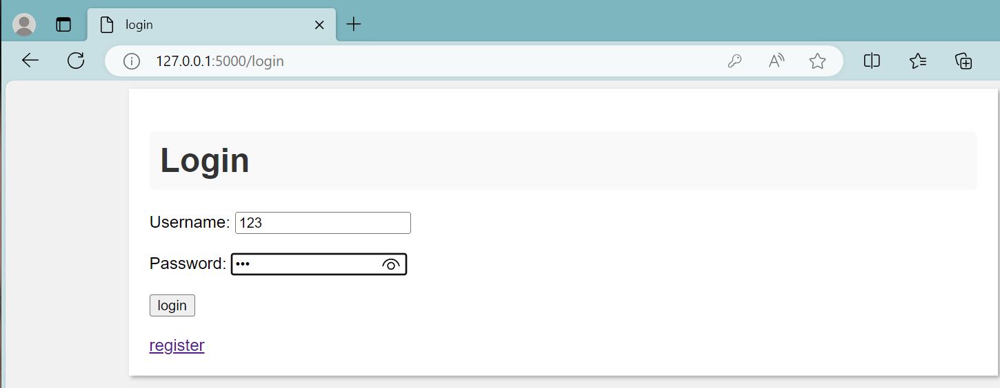


**register page**

input the username and password and click register, a new user will be created.

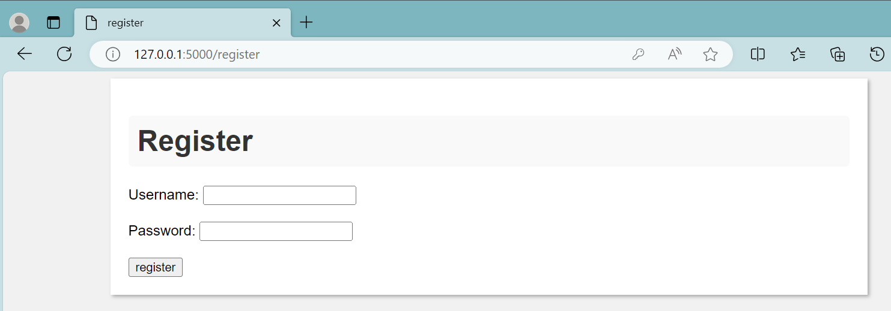


**main page--successful login**

when successful login,you can see all the user in the page.

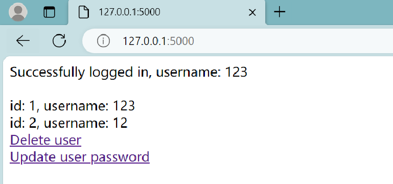


if you click on the Delete user ,it will change to the delete page. For example delete the user `12`

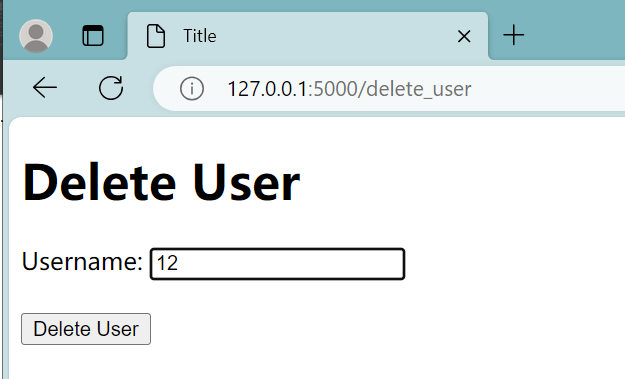

back to the main page, you will find the user `12`  has been deleted

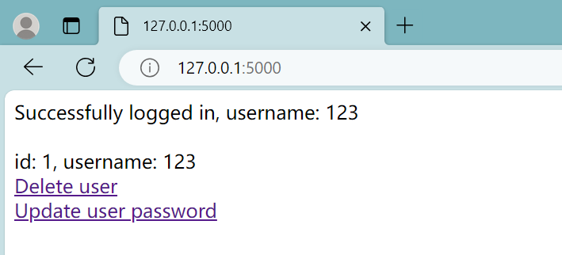

 

If you click on the Update user password. For example, we change the password of the `123`user. we changed the password from`12` to `123`

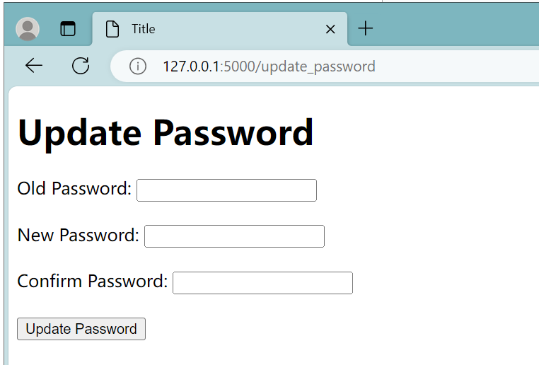

Then back to the login page, and we find the password has been changed.


