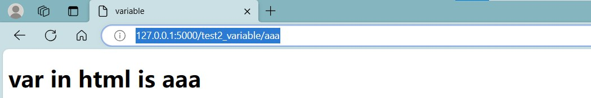

# jinja
## Introduction
简单介绍一下jinja
## Basic structure
在这里把整个流程介绍一下， 从app.py设置路由和视图函数， 到template文件设计结构。再到static里可以放置的一些像css， js,图片之类的文件
## Basic example
### ***variable***
#### **app .py**
a path should be given in "app.py": /test2_variable/<var_1>
`app.py`
```python
class Client:
    def __init__(self, id, name):
        self.ID = id
        self.Name = name

@app.route('/test2_variable/<var_1>')
def test2(var_1):  # put application's code here
    user = Client(1, "Dante")
    other_client = {
        "ID": 2,
        "name": "River"

    }
    return render_template("test2_variable.html", other_client_in_page = other_client, my_name="Dante", var_in_html = var_1, user_in_html = user)
```
- In this part, three variables are designed.
1. `var_1`: the variable is in the path and the data will be given by the clients. It will be transfer to the corresponding template.
2. `user`: this is a object from the class Client: ID is *1*, and name is *Dante*.
3. `other_client`: this is a directory with the ID of *2* and name of *river*
- `render_template` will help the programmer transfer the data in the variables to the template. And in template, those data will be saved in the corresponding variables in template. So, three new variables are designed.
1. `var_1`: var_in_html
2. `user`: user_in_html
3. `other_client`: other_client_page
4. new data can also be added directly in `render_tempate`, like "Dante" inside `my_name`.

#### **test2_variable.html**
In folder template. a file named `test2_variable.html` are designed.

If the programmer want to use the variables of the template, `{{the name of variable}}` is the rule to use them. two braces should be in both sides. In this file, `var_in_html` is used in line 10.

`test2_variable.html`
```html {.line-numbers}
<!DOCTYPE html>
<html lang="en">
<head>
    <meta charset="UTF-8">
    <title>variable</title>

</head>
<body>

    <h1>var in html is {{ var_in_html }}</h1>
    <h2>My name is Dante</h2>
    <h3>{{ user_in_html.ID }}</h3>
    <h3 style="color: white; background: black">user_in_html is {{ other_client_in_page.name }}</h3>
    <hr>

    {#bracket#}
</body>
</html>
```
- `var_in_html` the data inside the variable will be changed accroding to the path client input, the path **http://127.0.0.1:5000/test2_variable/aaa** is used to test, the data inside `var_in_html` is "aaa". it is the result from browser:


- `user_in_html` The data in the variable is an object with two parameters. We can use "variable.parameter_name" to show the parameters. It's similar to the common usage. Let it show the ID of the variable.


- `other_client_in_page` When we want to show the value in the directory, we can also use the same way: "variable.key_of_value". Let it show the name.


